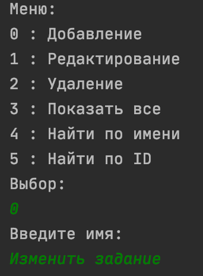
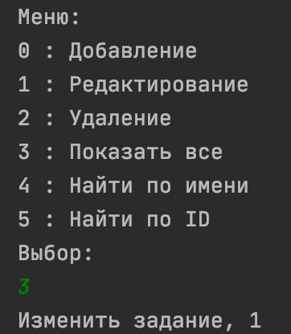
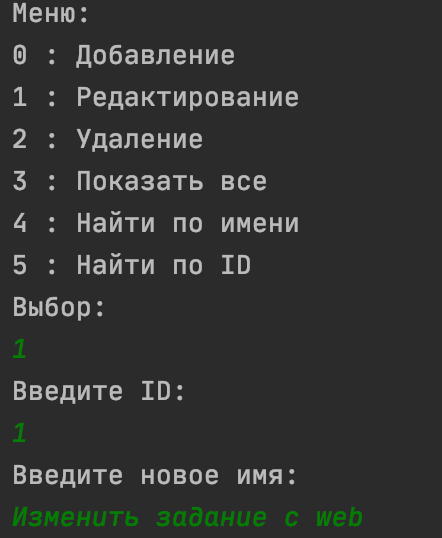
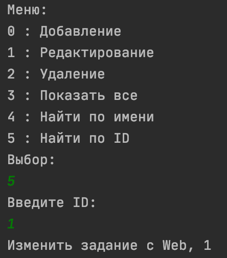
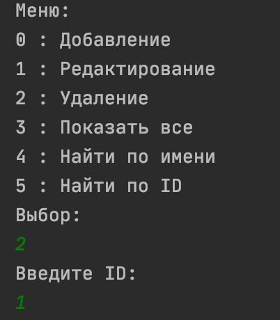

## Проект курса [job4j](http://job4j.ru)

### Tracker

Консольное приложение риализует добавление/изменение/удаление задачи.

Технологии:
- PostgresSQL
- JDBC
- Hibernate
- Spring
- Log4j
- JUnit
- Шаблон наблюдатель

Создание задачи

Посмотреть все задачи

Изменить задачу

Найти задачу по ID

Удаление задачи
